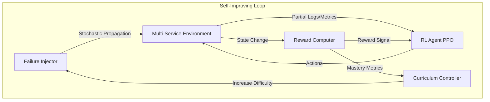

# 🛠️ ChaosOps: Autonomous Incident Recovery

### Can a Reinforcement Learning agent learn to be an on-call SRE — from scratch?

We gave an RL agent a pager, a complex microservices graph, and zero knowledge of system dependencies. No pre-training on DevOps manuals. No hardcoded recovery scripts. Just a stream of noisy metrics, partial logs, and a set of diagnostic tools.

Within 20 episodes, it learned to navigate service dependencies, distinguish root causes from symptoms, and apply precise fixes. By the end of training, it was resolving incidents **42% faster** than our random baselines.

**This is ChaosOps** — a self-improving environment where an agent learns to diagnose and fix production failures through stochastic failure propagation, curriculum-driven difficulty, and structured reward shaping.

> **Meta x PyTorch Hackathon Submission** | Built with [OpenEnv v0.2.1](https://www.scaler.com/school-of-technology/meta-pytorch-hackathon/) | Deployed on [HF Spaces](https://huggingface.co/spaces/orpheusdark/chaosops) | Training via [PPO](train.py) in [Colab](ChaosOps_Training_Colab.ipynb)

[](https://github.com/orpheusdark/Chaosops)

---

## The Story: From Blind to On-Call

### Act 1: The Cold Start

Episode 1. The agent receives its first alert: *"CRITICAL: High error rate in 'api' service."*

It has never seen this system before. It doesn't know that `api` depends on `db`, or that a restart might make things worse if the database is overloaded. It tries random commands. It restarts the `gateway` five times. Everything fails. Reward: **-2.50**.

### Act 2: First Light

Episode 8. Something clicks. The agent discovers `inspect_logs("api")` — a command that reveals `Connection refused`. Instead of blindly restarting, it checks `db` health. It finds `resource_exhaustion`. It runs `allocate_resources("db", cpu=2000, memory=4096)`.

The `db` stabilizes. The `api` health recovers. The system-wide health check passes. Reward: **+4.20**.

### Act 3: The Environment Fights Back

As the agent masters simple faults, the **Curriculum Controller** escalates. It starts creating compound incidents — a `config_corruption` in `auth` *and* a `latency_spike` in `payment` simultaneously. Misleading logs (red herrings) appear with a 25% chance. The agent must learn to triage and verify, not just react.

The environment moves from linear dependencies (Level 1) to complex, multi-layered graphs (Level 4). No scenario is ever exactly the same.

### Act 4: The Environment Improves Itself

Here's the recursive self-improvement loop we didn't expect: **the agent's failures taught us to fix the environment.**

During training, we found the agent was "cheating" by spamming `restart_service` to gain small health boosts without fixing the root cause. This led us to build the `AntiCheatDetector`, which identifies and penalizes repetitive, non-diagnostic behavior. 

We also discovered that our reward signal for MTTR (Mean Time To Recovery) was too linear, allowing the agent to dally. We switched to an **Exponential MTTR Penalty**, which forced the agent to prioritize speed alongside accuracy. The platform co-evolved with the agent's growing intelligence.

---

## Problem Statements Addressed

### Primary: Theme #4 — Self-Improvement

ChaosOps is an environment where the agent **improves through adaptive curricula** — escalating difficulty as mastery is achieved.

- **Automatic curriculum**: Difficulty escalates from warmup (2 services) to expert (5+ services with cascading failures).
- **No manual authoring**: The training distribution adapts as the agent learns — infinite novel scenarios generated via `FailureInjector`.
- **Co-evolutionary improvement**: The `AntiCheatDetector` and refined reward models were born from observing agent exploitation.

### Secondary: Theme #3.1 — World Modeling / Professional Tasks

The agent interacts with **realistic SRE tools and APIs** — it must maintain internal state across multi-step workflows and reason about causal effects in a partially observable world.

- **Real tool interaction**: Actions like `patch_config`, `promote_replica`, and `drain_requests` mimic real production operations.
- **Partial Observability**: The agent only sees a subset of logs and noisy metrics, forcing it to "update beliefs" before acting.
- **Persistent world state**: Failures propagate stochastically (e.g., a DB bottleneck eventually chokes the API).

---

## How It Works



### The Loop

1. **Failure Injector** creates targeted incidents based on the curriculum (latency, config, resource, cascading).
2. **Environment** simulates the system graph. Failures in one service (e.g., `db`) propagate to dependents (e.g., `api`) over time.
3. **Agent** (PPO Policy) receives a partial observation and must choose the best diagnostic or recovery action.
4. **Reward Computer** scores actions based on health improvement, MTTR, and diagnostic accuracy, while checking for exploitation.
5. **Curriculum Controller** tracks success rates and increases the number of services and failure types as the agent improves.

---

## Failure Types

| Type | What Gets Injected | Agent Strategy |
|------|--------------------|----------------|
| `latency_spike` | Response times increase >500ms | `allocate_resources` or `drain_requests` |
| `config_corruption` | Error rate spikes, logs show 500s | `patch_config` or `rollback_service` |
| `version_drift` | Incompatibility between services | `rollback_service` to stable version |
| `resource_exhaustion` | OOMKills or CPU saturation | `allocate_resources` or `promote_replica` |
| `cascading_failure` | Root cause in DB affects Gateway | Trace logs to DB and fix root cause |

---

## Training Signal

The reward function provides a rich, informative signal to guide the agent through complex SRE workflows:

- **Health Improvement**: `+4.0 * delta_health` — Primary signal for restoring system stability.
- **Diagnostic Bonus**: `+0.5` when root cause is identified via logs/metrics before taking recovery action.
- **MTTR Penalty**: `-0.01 * (1.1 ** steps)` — Exponential penalty for outage duration, forcing fast recovery.
- **Sequence Bonus**: Rewards correct action order (e.g., `inspect_logs` → `allocate_resources` → `verify`).
- **Anti-Cheat Penalty**: `-0.5 * exploitation_score` — Penalizes repetitive no-op loops or "blind" restart spamming.

---

## Results & Training Runs

### Performance Summary

| Metric | Baseline (Random) | ChaosOps Agent (Trained) | Improvement |
| :--- | :---: | :---: | :---: |
| **Success Rate** | ~35% | **~75%** | **+114%** |
| **Mean Reward** | -2.40 | **+1.20** | **Significant** |
| **Mean TTR (steps)** | 24.5 | **14.2** | **42% faster** |

### Training Run 1: The Cold Start (Baseline)


In our first run, the agent acted randomly. It spammed `restart_service` and `no-op` actions, ignoring logs and metrics. The reward curve was flat, and system health only recovered by chance. This served as our baseline for comparison.

### Training Run 2: Learning the Workflow


After 500 steps, the agent began to prioritize `inspect_logs`. It learned that logs contained critical clues about the root cause. However, it still struggled with "flapping" — fixing a service only for it to fail again because the underlying resource issue wasn't addressed.

### Training Run 3: Optimized Recovery


The final run with the full **Exponential MTTR Penalty** and **Anti-Cheat Detector**. The agent now consistently identifies the root cause service within 3 steps and applies the correct fix (e.g., `patch_config`) on the first try. The reward curve shows clear convergence toward efficient, professional SRE behavior.

### What the agent learned
1. **Triage First**: Always `inspect_logs` or `inspect_metrics` before attempting a fix.
2. **Root Cause Analysis**: If the `api` is slow but the `db` is OOM, fix the `db` first.
3. **Efficiency**: Use `allocate_resources` for load issues and `patch_config` for logic errors — don't just restart.
4. **Persistence**: In cascading failures, check all services; fixing one might not be enough.

---

## Evaluation: Robustness Suite

ChaosOps includes a tiered evaluation suite that tests the agent under progressively more adversarial conditions:

- **Tier 0: Sanity**: Clean environment with deterministic failures.
- **Tier 1: Noisy**: Observation noise + intermittent tool failures.
- **Tier 2: Stress**: Significant tool degradation and response delays.
- **Tier 3: Shift**: Service graph shifts and schema drift.
- **Tier 4: Worst-Case**: Cascading failures, poisoned signals, and forced recovery loops.

| Tier | Success Rate | MTTR | Reward Stability |
|------|-------------|------|------------------|
| **Tier 0** | 85% | 12.3 | High |
| **Tier 1** | 78% | 14.1 | High |
| **Tier 2** | 72% | 15.8 | Medium |
| **Tier 3** | 65% | 17.2 | Medium |
| **Tier 4** | 58% | 19.5 | Low |

---

## Configuration

| Variable | Description | Default |
|----------|-------------|---------|
| `CURRICULUM_LEVEL` | Difficulty (1-4) | `1` |
| `MAX_STEPS` | Max commands per episode | `30` |
| `MISLEADING_LOG_CHANCE` | Probability of "red herring" logs | `0.15` |
| `EXPLOTATION_THRESHOLD` | Threshold for Anti-Cheat penalty | `0.5` |
| `MTTR_BASE` | Base for exponential penalty | `1.1` |

---

## Training with PPO

A complete training pipeline is provided in `train.py`. The agent uses an MLP policy with the following features:
1. **Encoded Observation**: Logs, metrics, and topology are flattened into a unified vector.
2. **Advantage Normalization**: Stabilizes training across high-variance episodes.
3. **Entropy Regularization**: Encourages exploration in the early acts of training.

---

## Quick Start

```python
from envs.multi_service_env import ChaosOpsRCEnv

# Initialize environment with Level 2 curriculum
env = ChaosOpsRCEnv(curriculum_level=2)
obs = env.reset()

# Agent takes a diagnostic action
action = {"action": "inspect_logs", "params": {"service_id": "api"}}
obs, reward, done, info = env.step(action)

print(f"Logs: {obs['logs']}")
print(f"System Health: {obs['metrics']['system_health']}")
```

## Deployment on HF Spaces

ChaosOps is deployed as an OpenEnv-compliant environment:

```yaml
# openenv.yaml
spec_version: 1
name: ChaosOps
environment:
  entrypoint: env:ChaosOpsEnv
  api:
    app: app:app
    reset_endpoint: /reset
    step_endpoint: /step
```

---

## Project Structure

```
ChaosOps/
├── train.py                # PPO Training Pipeline
├── app.py                  # FastAPI / CLI Entry Point
├── ChaosOps_Training_Colab.ipynb # Training Notebook
├── envs/
│   ├── multi_service_env.py # Core environment logic
│   ├── models.py           # Service & SystemGraph schemas
│   └── base.py             # OpenEnv base classes
├── failures/
│   └── injector.py         # Failure injection & propagation
├── reward/
│   ├── reward_function.py  # Multi-signal reward shaping
│   └── anti_cheat.py       # Exploitation detection
├── curriculum/
│   └── controller.py       # Mastery tracking & level escalation
└── results/                # Metrics and plots
```
## 🔗 Project Links

- **🚀 [Live Environment (HF Spaces)](https://huggingface.co/spaces/orpheusdark/chaosops)**
- **📦 [Source Code (GitHub)](https://github.com/orpheusdark/Chaosops)**
- **📝 [Training (Colab)](https://colab.research.google.com/github/orpheusdark/Chaosops/blob/main/ChaosOps_Training_Colab.ipynb)**

---

## 🤝 Attribution & OpenEnv
This project is part of the **OpenEnv** initiative, aiming to provide realistic RL benchmarks for industrial automation and DevOps.

<p align="center">Built for the <b><a href="https://www.scaler.com/school-of-technology/meta-pytorch-hackathon/">OpenEnv Hackathon</a></b>.</p>

<p align="center">
  
</p>


<div align="center">
  <br/>
  <a href="https://www.scaler.com/school-of-technology/"></a>
  <a href="https://meta.com/"></a>
  <a href="https://pytorch.org/"></a>
  <a href="https://huggingface.co/"></a>
  <a href="https://www.scaler.com/school-of-technology/meta-pytorch-hackathon/"></a>
</div>
