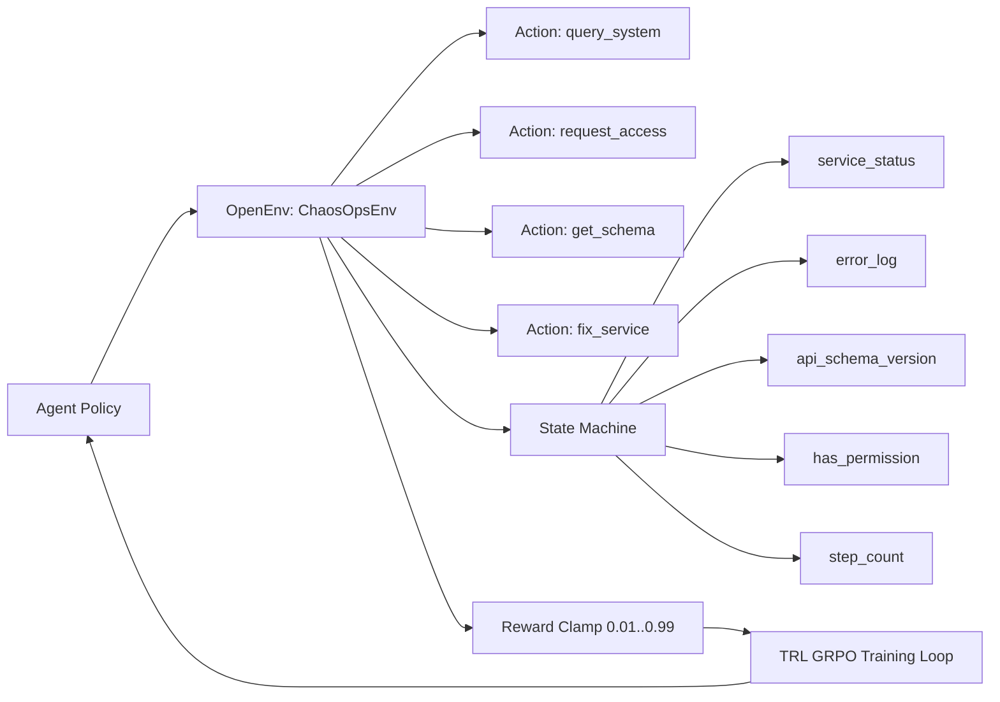

# ChaosOps

ChaosOps is a runnable OpenEnv-style RL environment for multi-step LLM agent recovery workflows.

## What It Simulates

1. Auth service starts crashed (`OOMKilled`)
2. Agent inspects the system
3. Agent requests access token with proper justification
4. API schema drifts mid-episode (v1 -> v2)
5. Agent adapts and fixes service

## Local Run

```powershell
cd chaosops
python -m pip install -r requirements.txt
python -m uvicorn app:app --host 127.0.0.1 --port 8000
```

## API Smoke Test

```powershell
$resetBody = @{ task = 'task3' } | ConvertTo-Json
Invoke-RestMethod -Method Post -Uri http://127.0.0.1:8000/reset -ContentType 'application/json' -Body $resetBody
```

## Architecture Visual



## GitHub Push

```powershell
git add .
git commit -m "Update ChaosOps run/train settings and deployment docs"
git push origin main
```

## Hugging Face Space Push (Docker)

1. Create a new Space with SDK = Docker.
2. Clone your Space repo locally.
3. Copy this project into the Space repository root.
4. Push to Hugging Face:

```powershell
git remote add hf https://huggingface.co/spaces/<HF_USERNAME>/chaosops
git push hf main
```

If prompted, use your Hugging Face username and a write token as password.
